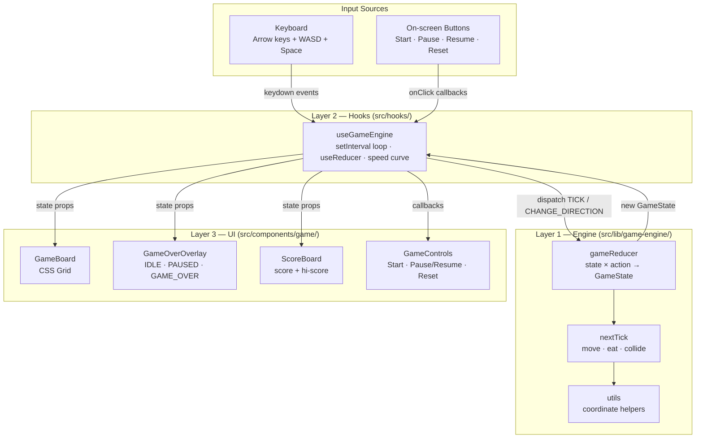

# 🐍 Snake

A classic Snake game built with **Next.js 15**, **React 19**, and **TypeScript** — featuring a clean three-layer architecture that keeps game logic, state management, and rendering completely decoupled.

---

## Table of Contents

- [Live Demo](#live-demo)
- [Screenshots](#screenshots)
- [Architecture Overview](#architecture-overview)
  - [Layer 1 — Engine](#layer-1--engine-srclibgame-engine)
  - [Layer 2 — Hook](#layer-2--hook-srchooks)
  - [Layer 3 — UI](#layer-3--ui-srccomponentsgame)
  - [Data flow diagram](#data-flow-diagram)
  - [Architecture diagram (Mermaid)](#architecture-diagram-mermaid)
- [Project Structure](#project-structure)
- [Getting Started](#getting-started)
- [Development Commands](#development-commands)
- [Game Controls](#game-controls)
- [Configuration](#configuration)
- [Testing](#testing)
- [Tech Stack](#tech-stack)

---

## Live Demo

> 🚀 **[Play Snake — Live Demo](https://snake-game-demo.vercel.app)**
>
> _Replace the URL above with your actual deployment link once published._

Deploy your own in one click:

[](https://vercel.com/new/clone?repository-url=https://github.com/your-username/snake)

To run locally, start the dev server and open [http://localhost:3000](http://localhost:3000).

---

## Screenshots

| Idle / Start screen | Gameplay | Game Over |
|---|---|---|
|  |  |  |

> **Capturing your own screenshots / GIF**
> 1. Run `npm run dev` and open [http://localhost:3000](http://localhost:3000)
> 2. **Static screenshots:** macOS `⌘⇧4`, Windows `Win+Shift+S`, Linux `gnome-screenshot -a`
> 3. **Animated GIF:** record with [LICEcap](https://www.cockos.com/licecap/) (Windows/macOS) or [Peek](https://github.com/phw/peek) (Linux) at ~15 fps, crop to the board area
> 4. Save files to `docs/screenshots/` — names must match the table above (`idle.png`, `gameplay.gif`, `game-over.png`)

---

## Architecture Overview

The codebase enforces a **strict three-layer separation** so that each concern can be understood, tested, and replaced independently.

```
┌─────────────────────────────────────────────────────────────┐
│                    Layer 3 — UI                              │
│           src/components/game/  +  src/app/                 │
│   GameBoard · GameOverOverlay · ScoreBoard (pure presentational) │
└───────────────────────┬─────────────────────────────────────┘
                        │  props + callbacks (no actions)
┌───────────────────────▼─────────────────────────────────────┐
│                    Layer 2 — Hook                            │
│                    src/hooks/                                │
│   useGameEngine  (game loop, timers, dispatch)               │
└───────────────────────┬─────────────────────────────────────┘
                        │  pure function calls
┌───────────────────────▼─────────────────────────────────────┐
│                    Layer 1 — Engine                          │
│               src/lib/game-engine/                           │
│   gameReducer · buildInitialState · utils                    │
│   (no React, no timers, no side effects)                     │
└─────────────────────────────────────────────────────────────┘
```

### Layer 1 — Engine (`src/lib/game-engine/`)

The **pure functional core**. No React imports, no `setTimeout`, no randomness that can't be seeded.

| File | Responsibility |
|---|---|
| `reducer.ts` | `gameReducer(state, action, config) → GameState` — all state transitions as a discriminated union switch. Returns a new immutable snapshot every tick. |
| `engine.ts` | Top-level engine orchestration: builds initial state, wires nextTick and the reducer together. |
| `next-tick.ts` | `nextTick` — moves the snake, detects food consumption and wall/self collisions. |
| `utils.ts` | Stateless helpers: `coordinatesEqual`, `moveCoordinate`, `wrapCoordinate`, `isOppositeDirection`, `randomFreeCoordinate`. |
| `index.ts` | Public barrel — consumers import from `@/lib/game-engine`, never from internal paths. |

**Key design decisions:**
- Immutable snapshots: every action returns a brand-new `GameState` — the previous state is never mutated.
- No React dependency: the engine can be lifted into a Web Worker for large boards without any refactoring.
- Exhaustive action handling: TypeScript discriminated unions cause a compile error if a new action type is added without a matching `case`.

### Layer 2 — Hook (`src/hooks/`)

The **stateful glue** between the pure engine and React.

| File | Responsibility |
|---|---|
| `useGameEngine.ts` | Wraps `gameReducer` in `useReducer`. Drives the game loop via `setInterval`. Dynamically adjusts tick speed as score increases. Exposes stable callbacks (`start`, `pause`, `resume`, `reset`, `changeDirection`). |

**Key design decisions:**
- The hook is the **only** place aware of time (`setInterval`). The reducer stays pure and testable without fake timers.
- `useCallback` on all dispatch wrappers stabilises references for dependency arrays.
- `useRef` for the interval ID prevents stale-closure bugs.

### Layer 3 — UI (`src/components/game/`)

**Purely presentational** — receives pre-computed data as props and dispatches no actions directly.

| Component | Responsibility |
|---|---|
| `GameBoard.tsx` | CSS-grid board. Classifies each cell (`head` / `body` / `food` / `empty`) and applies Tailwind classes. Keyed by `x-y` string to minimise DOM diffing. |
| `GameControls.tsx` | Stateless toolbar: **Start**, **Pause/Resume** toggle, **Reset**. Enables/disables each button based solely on `status`. |
| `GameOverOverlay.tsx` | Semi-transparent overlay shown when status is `IDLE`, `PAUSED`, or `GAME_OVER`. Hidden (`null`) while `RUNNING`. |
| `ScoreBoard.tsx` | Displays current score and session high score. |

**Key design decisions:**
- CSS Grid (not `<canvas>`) for an accessible DOM tree and Tailwind-compatible styling.
- `role="grid"` + `aria-label` for screen-reader support.
- `role="dialog"` + `aria-modal` on the overlay while the game is inactive.

### Data flow diagram

```
Keyboard / Timer / Buttons
      │
      ▼
useGameEngine (setInterval → TICK, action dispatch)
      │  dispatch(action)
      ▼
gameReducer(state, action) ──► new GameState
      │
      ▼
React re-render
      │  props
      ▼
GameBoard / GameOverOverlay / ScoreBoard / GameControls
```

### Architecture diagram (Mermaid)



---

## Project Structure

```
snake/
├── src/
│   ├── app/                        # Next.js App Router entry points
│   │   ├── layout.tsx
│   │   ├── page.tsx
│   │   └── globals.css
│   ├── components/
│   │   └── game/                   # Layer 3 — UI (presentational)
│   │       ├── GameBoard.tsx       # CSS Grid board
│   │       ├── GameControls.tsx    # Start · Pause/Resume · Reset toolbar
│   │       ├── GameOverOverlay.tsx # Idle / paused / game-over overlay
│   │       └── ScoreBoard.tsx      # Score + high score display
│   ├── hooks/                      # Layer 2 — Hook (stateful glue)
│   │   ├── useGameEngine.ts        # game loop, speed curve, dispatch wrappers
│   │   └── index.ts
│   ├── lib/
│   │   └── game-engine/            # Layer 1 — Engine (pure functions)
│   │       ├── reducer.ts          # gameReducer (all state transitions)
│   │       ├── engine.ts           # engine orchestration
│   │       ├── next-tick.ts        # nextTick (move, eat, collide)
│   │       ├── utils.ts            # coordinate helpers
│   │       └── index.ts            # public barrel
│   ├── types/
│   │   ├── game.ts                 # GameState, GameEvent, GameConfig, Position, Direction
│   │   └── index.ts
│   └── __tests__/                  # Unit tests (Vitest)
│       ├── components/
│       │   ├── GameBoard.test.tsx
│       │   ├── GameControls.test.tsx
│       │   └── ScoreBoard.test.tsx
│       ├── game-engine-reducer.test.ts
│       └── useGameEngine.test.ts
├── docs/
│   └── screenshots/                # README screenshots / GIFs
├── next.config.ts
├── tailwind.config.ts              # (if present)
├── tsconfig.json
└── package.json
```

---

## Getting Started

### Prerequisites

| Tool | Version |
|---|---|
| Node.js | `>= 20.x` |
| npm | `>= 10.x` (bundled with Node 20) |

### Installation

```bash
# 1. Clone the repository
git clone <repo-url>
cd snake

# 2. Install dependencies
npm install

# 3. Start the development server
npm run dev
```

Open [http://localhost:3000](http://localhost:3000) in your browser.

---

## Development Commands

| Command | Description |
|---|---|
| `npm run dev` | Start Next.js development server with Fast Refresh |
| `npm run build` | Compile a production-optimised build |
| `npm run start` | Serve the production build locally |
| `npm run lint` | Run ESLint across the project |
| `npm test` | Run all unit tests with Vitest (single run) |
| `npm run test:watch` | Run tests in watch mode |

---

## Game Controls

### Keyboard

| Key | Action |
|---|---|
| `↑` / `W` | Move up |
| `↓` / `S` | Move down |
| `←` / `A` | Move left |
| `→` / `D` | Move right |
| `Space` | Pause / Resume |

> **Anti-diagonal protection:** Only one direction change is accepted per tick. Rapid key-mashing cannot cause the snake to reverse into itself — a 180° reversal is silently ignored.

### On-screen Buttons

| Button | Enabled when | Action |
|---|---|---|
| **Start** | `IDLE` only | Begin a new game |
| **Pause** | `RUNNING` only | Freeze the game loop |
| **Resume** | `PAUSED` only | Continue from where you left off |
| **Reset** | `RUNNING`, `PAUSED`, or `GAME_OVER` | Discard current game, return to Idle |

> **Smart toggle:** Pause and Resume share the same toolbar slot — the contextually correct button is shown based on the current `GameStatus`. Neither appears when the game is `IDLE` or `GAME_OVER`.

### Mobile / Touch

The game is keyboard- and button-driven by default. For touch support you can extend `useGameEngine` with a swipe hook and wire it to the `changeDirection` callback.

---

## Configuration

Game parameters are tunable via `GameConfig` — pass them to `useGameEngine`:

```ts
const { state, start } = useGameEngine({
  boardWidth: 30,       // columns (default: 20)
  boardHeight: 30,      // rows    (default: 20)
  initialTickMs: 200,   // starting tick interval in ms (default: 150)
  minTickMs: 80,        // fastest possible tick (default: 60)
  scorePerPellet: 5,    // points per food pellet (default: 10)
});
```

All fields are optional — omit any to use the built-in default. The speed curve accelerates automatically as the score increases, up to `minTickMs`.

---

## Testing

Tests live in `src/__tests__/` and use **Vitest** + **React Testing Library**.

```bash
# Single run
npm test

# Watch mode
npm run test:watch
```

**What's tested:**

| Suite | Focus |
|---|---|
| `game-engine-reducer.test.ts` | Pure reducer transitions: START, TICK, PAUSE, RESUME, RESET, CHANGE_DIRECTION, collision detection, food consumption |
| `useGameEngine.test.ts` | Hook integration: game loop timing, score accumulation, high score persistence |
| `GameBoard.test.tsx` | Cell classification (head / body / food / empty), grid dimensions |
| `GameControls.test.tsx` | Button enabled/disabled states per `GameStatus`, click handler invocations |
| `ScoreBoard.test.tsx` | Score and high-score display |

The engine layer (`reducer.ts`, `utils.ts`) is the primary test target — pure functions with no React dependency make unit testing straightforward and fast.

---

## Tech Stack

| Technology | Role |
|---|---|
| [Next.js 15](https://nextjs.org) | App Router, SSR, production build |
| [React 19](https://react.dev) | UI rendering, hooks |
| [TypeScript 5](https://www.typescriptlang.org) | Static typing, discriminated unions |
| [Tailwind CSS](https://tailwindcss.com) | Utility-first styling |
| [Vitest](https://vitest.dev) | Unit & integration testing |
| [React Testing Library](https://testing-library.com) | Component testing |
