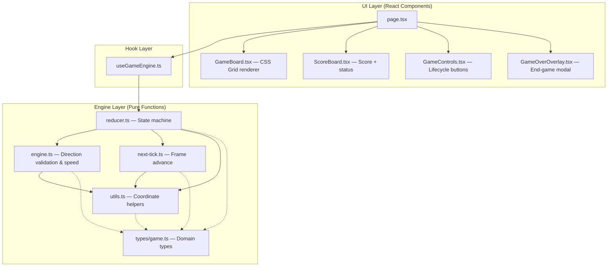

# 🐍 Snake Game

A modern Snake game built with **Next.js 15**, **TypeScript**, and **CSS Grid**, featuring a pure-functional game engine, immutable state management, and responsive touch controls.

> **Live Demo:** [https://snake-game-demo.vercel.app](https://snake-game-demo.vercel.app)
>
> [](https://vercel.com/new/clone?repository-url=https://github.com/desoul1412/snake)

---

## Screenshots

| Idle | Gameplay | Game Over |
|:----:|:--------:|:---------:|
|  |  |  |

> **Note:** Screenshots are placeholders. To capture your own:
> 1. Run the app locally (`npm run dev`)
> 2. Take screenshots at each game state (idle → playing → game over)
> 3. Use a tool like [LICEcap](https://www.cockos.com/licecap/) or [Kap](https://getkap.co/) to record a gameplay GIF
> 4. Save files to `docs/screenshots/` and they will appear above automatically

---

## Game Controls

### Keyboard

| Key | Action |
|-----|--------|
| `↑` / `W` | Move Up |
| `↓` / `S` | Move Down |
| `←` / `A` | Move Left |
| `→` / `D` | Move Right |

- Arrow keys and WASD are both supported (case-insensitive)
- 180° reversal is blocked — pressing the opposite direction of travel is silently ignored
- Direction changes are queued and applied on the next tick, preventing rapid-input exploits

### On-Screen Buttons

| Button | Enabled When | Action |
|--------|-------------|--------|
| **Start** | `IDLE` | Begins a new game |
| **Pause** | `RUNNING` | Suspends the game loop |
| **Resume** | `PAUSED` | Resumes from pause |
| **Reset** | `RUNNING`, `PAUSED`, `GAME_OVER` | Returns to idle (preserves high score) |
| **Play Again** | `GAME_OVER` (overlay) | Resets and immediately starts a new game |

### Touch / Swipe (Mobile)

- Swipe in any cardinal direction on the game board to change the snake's heading
- Minimum 10px displacement threshold to distinguish swipes from taps
- Dominant axis wins: if `|dx| ≥ |dy|` → horizontal, otherwise vertical
- Same 180° reversal guard as keyboard input

---

## Architecture

The codebase follows a strict **three-layer architecture** with unidirectional data flow:

```
┌─────────────────────────────────────────────────┐
│                  UI Layer                        │
│  GameBoard · ScoreBoard · GameControls           │
│  GameOverOverlay · page.tsx                      │
│  (Pure presentation — all data via props)        │
├─────────────────────────────────────────────────┤
│                Hook Layer                        │
│  useGameEngine                                   │
│  (Keyboard/touch input → dispatch → interval)    │
├─────────────────────────────────────────────────┤
│              Engine Layer (pure functions)        │
│  reducer.ts · engine.ts · next-tick.ts · utils.ts│
│  (Zero React imports — framework-agnostic)       │
└─────────────────────────────────────────────────┘
```

### Data Flow

```
User Input (keyboard / touch / button click)
        │
        ▼
  useGameEngine hook
        │  dispatches GameEvent
        ▼
  gameReducer (pure function)
        │  returns new GameState
        ▼
  React re-render (via useReducer)
        │  passes props
        ▼
  UI Components (DOM update)
```

### Architecture Diagram (Mermaid)



### Engine Layer

| File | Responsibility |
|------|---------------|
| `types/game.ts` | Domain types: `Position`, `Direction`, `GameStatus`, `GameState`, `GameConfig`, `GameEvent` |
| `reducer.ts` | Pure reducer handling `START`, `PAUSE`, `RESUME`, `RESET`, `CHANGE_DIRECTION`, `TICK` actions |
| `engine.ts` | Direction validation (`validateDirectionChange`), speed scaling (`getTickInterval`), collision detection (`isWallCollision`, `isSelfCollision`) |
| `next-tick.ts` | Alternative frame-advance function with wall-collision (lethal, non-wrapping) semantics |
| `utils.ts` | `coordinatesEqual`, `moveCoordinate`, `wrapCoordinate`, `isOppositeDirection`, `randomFreeCoordinate`, `placeFood` |

### Hook Layer

| File | Responsibility |
|------|---------------|
| `useGameEngine.ts` | Wires the pure engine to React: `useReducer` for state, `setInterval` for the game loop, keyboard/touch event listeners. Returns `{ state, start, pause, resume, reset, changeDirection }` |
| `useSwipeControls.ts` | Touch/swipe gesture detection for mobile — analyses dominant-axis swipe delta (10 px threshold), converts `touchstart`/`touchend` events to `Direction` commands |

### UI Layer

| File | Responsibility |
|------|---------------|
| `page.tsx` | Root composition — calls `useGameEngine`, manages `localStorage` high score persistence, renders all child components |
| `GameBoard.tsx` | CSS Grid renderer — renders responsive grid with neon-glow snake (distinct lime head, green body), pulsing food pellet, and O(1) Set-based cell lookups |
| `ScoreBoard.tsx` | Displays current score, high score, and color-coded status badge (`role="status"`) |
| `GameControls.tsx` | Start / Pause / Resume / Reset button bar with state-aware enable/disable logic (`role="group"`) |
| `GameOverOverlay.tsx` | Modal overlay with final score, "New High Score!" detection, and Play Again button (`role="dialog"`) |

### Game State Lifecycle

```
IDLE ──(START)──▶ RUNNING ──(PAUSE)──▶ PAUSED
  ▲                  │                    │
  │                  │                    │
  └──────(RESET)─────┴────────────────────┘

RUNNING ──(collision)──▶ GAME_OVER ──(RESET)──▶ IDLE
```

---

## Project Structure

```
snake/
├── src/
│   ├── app/
│   │   ├── layout.tsx              # Root layout with metadata
│   │   ├── page.tsx                # Main game page
│   │   └── globals.css             # Tailwind + global styles
│   ├── components/
│   │   └── game/
│   │       ├── GameBoard.tsx       # CSS Grid game renderer
│   │       ├── GameControls.tsx    # Lifecycle control buttons
│   │       ├── GameOverOverlay.tsx # End-game overlay modal
│   │       └── ScoreBoard.tsx      # Score & status display
│   ├── hooks/
│   │   ├── useGameEngine.ts       # Core game hook
│   │   ├── useSwipeControls.ts    # Touch/swipe input for mobile
│   │   └── index.ts               # Barrel export
│   ├── lib/
│   │   └── game-engine/
│   │       ├── engine.ts           # Direction validation & speed
│   │       ├── next-tick.ts        # Pure frame advance
│   │       ├── reducer.ts          # Game state reducer
│   │       ├── utils.ts            # Coordinate utilities
│   │       └── index.ts            # Barrel export
│   ├── types/
│   │   ├── game.ts                 # All domain types
│   │   └── index.ts                # Barrel export
│   └── __tests__/
│       ├── game-engine-reducer.test.ts
│       ├── useSwipeControls.test.ts
│       ├── hooks/
│       │   └── useGameEngine.test.ts
│       └── components/
│           ├── GameBoard.test.tsx
│           ├── GameControls.test.tsx
│           ├── GameOverOverlay.test.tsx
│           └── ScoreBoard.test.tsx
├── public/
│   ├── favicon.svg                 # Pixel-art snake icon
│   └── og-image.svg                # Open Graph preview image
├── package.json
├── tsconfig.json
└── README.md
```

---

## Getting Started

### Prerequisites

- **Node.js** 18+ and **npm** (or pnpm/yarn)

### Installation

```bash
git clone https://github.com/desoul1412/snake.git
cd snake
npm install
```

### Development

```bash
npm run dev          # Start dev server at http://localhost:3000
npm run build        # Production build
npm run start        # Serve production build
npm run lint         # Run ESLint
npm test             # Run test suite
```

---

## Configuration

The game engine accepts an optional `GameConfig` object:

| Parameter | Default | Description |
|-----------|---------|-------------|
| `boardWidth` | `20` | Board width in cells |
| `boardHeight` | `20` | Board height in cells |
| `initialTickMs` | `150` | Starting interval between ticks (ms) |
| `minTickMs` | `60` | Fastest possible tick interval (ms) |
| `scorePerPellet` | `10` | Points awarded per food pellet |

Speed increases dynamically as the player's score rises. The tick interval decreases from `initialTickMs` toward `minTickMs` based on score progression.

---

## Tech Stack

| Layer | Technology |
|-------|-----------|
| Framework | [Next.js 15](https://nextjs.org/) (App Router) |
| Language | [TypeScript 5](https://www.typescriptlang.org/) |
| Styling | [Tailwind CSS](https://tailwindcss.com/) |
| Rendering | CSS Grid + inline `boxShadow` neon glows |
| State | React `useReducer` (pure functional) |
| Testing | [Vitest](https://vitest.dev/) / React Testing Library |

---

## Design Principles

- **Pure-functional engine** — zero side effects, deterministic, safe to run in a Web Worker
- **Immutable state** — every tick produces a new `GameState` snapshot; no mutation
- **Framework-agnostic core** — the engine has no React imports and can be reused in any JS runtime
- **Accessibility** — ARIA roles (`status`, `dialog`, `group`, `img`), keyboard navigation, screen reader support
- **Mobile-first** — responsive CSS Grid scaling, touch swipe controls, viewport meta tags
- **Testable in isolation** — each layer can be tested independently without mocking the others

---

## License

MIT
